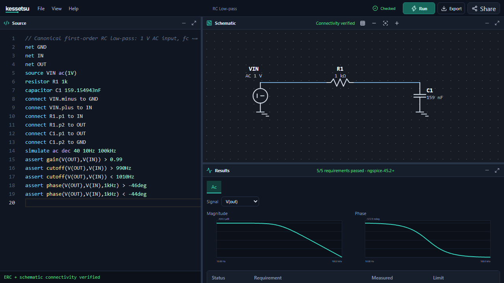
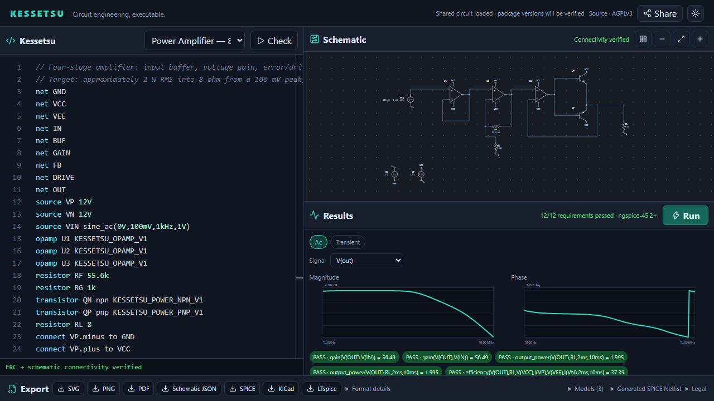

# Kessetsu

[Web Hub](https://kessetsu.com/) · [Install CLI](https://kessetsu.com/install/) · [Documentation](docs/README.md) · [Tutorial](docs/guides/tutorial.md) · [Supported domain](docs/reference/supported-domain.md)

Kessetsu is an agent-driven circuit engineering platform for describing circuits as text, compiling and simulating them like software, and verifying them with engineering assertions. The CLI's human mode serves engineers, its versioned JSON mode serves AI agents and automation, and the zero-friction Web Hub serves browser users. Every surface uses the same Rust Core: typed Circuit IR, deterministic graph/ERC, SPICE netlists, schematics, and EDA outputs all derive from shared semantics.

```text
Electrical requirements → Kessetsu source → compile/ERC → simulate/measure/assert → structured feedback
```

The project is not limited to a particular educational scenario or circuit class. Its goal is to let people and AI agents start from measurable requirements and iteratively develop topology, value, and model choices using reliable structured feedback.

## Current capabilities

- Rust parser, module flattening, and typed Circuit IR
- Unit-checked named parameters, reusable circuit modules and CLI numeric overrides
- Hash-verified local op-amp/comparator/two-terminal models, with explicit browser file selection
- Versioned compile reports (`kessetsu.compile.v6`) and the `kessetsu.schematic.v3` schematic contract
- Deterministic net naming and `KES-P/C/E/I/S/F` diagnostic namespaces
- SPICE generation, simulator discovery/provenance, and a Windows Ngspice sidecar runtime
- Typed OP/transient/AC/DC simulation results and PASS/FAIL/ERROR/SKIPPED assertion evaluation
- Compact `kessetsu.cli.v1` JSON, stdin-based agent loops, and opt-in debug fields through `--include`
- Evaluator-owned, exact-hash `.kessreq` files for agent loops that must not rewrite their own acceptance criteria
- Typed user/package model and subcircuit resolution, provenance manifests, and `kessetsu.lock`
- Human/JSON CLI modes with safe output, overwrite, and exit-code contracts
- A React Web Hub with WASM Core and real in-browser simulation
- A canonical, connectivity-verified automatic schematic engine
- SVG, PNG, PDF, Schematic JSON, SPICE, KiCad, and LTspice exports
- Versioned, compressed, package-aware share URLs
- Shared loaded-divider and RC-filter tools with typed inputs, standard component selection and editable circuit generation (CLI 1.1.0+)
- Development source: reproducible parameter studies, local research-data comparison,
  finite calibration/holdout fitting and a thin Python/Jupyter adapter over the same Core contracts

Read the [documentation](https://kessetsu.com/docs/) and [changelog](https://kessetsu.com/changelog/) on the website. The [architecture](docs/architecture.md), [component and simulation reference](docs/reference/supported-domain.md), and [measurement reference](docs/reference/measurements.md) define technical behavior and assumptions.

## Web Hub

Kessetsu Web Hub is the primary product surface for people who want to develop circuits directly in a simple, CodePen-like browser workspace. It does not maintain a separate Web-only engine; it runs the same canonical Rust Core as the CLI through WebAssembly.

The current repository build can:

- Edit Kessetsu source in Monaco and switch between example circuits
- Open and save `.kess` files, name documents, and recover an unsaved versioned browser draft
- Run live compilation, ERC, and canonical schematic-connectivity verification through WASM
- Run real OP/transient/AC/DC simulations inside a Web Worker
- Inspect interactive waveform, Bode, and DC plots plus assertion results
- Explore the canonical schematic with zoom and fit controls
- Download seven visual, machine, and EDA formats with capability/loss information
- Share source and exact package versions in a compressed URL
- Start from a [loaded divider](https://kessetsu.com/tools/voltage-divider/) or [RC filter](https://kessetsu.com/tools/rc-lowpass/) calculation and continue in the editor

Use your own AI agent through the CLI's stdin and versioned JSON contract. The Web Hub is a direct editing and simulation workspace, not a built-in AI chat; both use the same Core.





## A small Kessetsu example

```kessetsu
net GND
net out

source V1 5V
resistor R1 1k

connect V1.plus, R1.p1 to out
connect V1.minus, R1.p2 to GND

simulate op
```

Compiling the same source in the CLI or Web Hub produces the same IR, diagnostics, and SPICE result.

## Quick start

The [guided installation page](https://kessetsu.com/install/) explains how to open your terminal, install, and try a circuit. No account, compiler, administrator access, manual extraction, or PATH editing is needed for the CLI installer.

Windows: open **Windows PowerShell**, paste, and press Enter:

```powershell
irm https://kessetsu.com/install.ps1 | iex
```

macOS or Linux: open **Terminal**, paste, and press Enter:

```sh
curl -fsSL https://kessetsu.com/install.sh | sh
```

On Windows, run `kess --version` in the same PowerShell session after installation. Otherwise, open a new terminal. Restart an already-running IDE/agent if it still cannot find the command, or use the full launcher path printed by the installer. Run the same installation command to update. These commands execute installer code from the website; inspect [PowerShell](webapp/public/install.ps1) or [POSIX](webapp/public/install.sh) source first if preferred. Installers verify archive/executable SHA-256 and version before replacing the managed launcher, and retain old bundles. Checksums are integrity checks, not publisher signatures.

Windows includes Ngspice. Linux/macOS simulation requires a separate trusted Ngspice installation: `brew install ngspice` on macOS with [Homebrew](https://brew.sh/), or `sudo apt-get update && sudo apt-get install ngspice` on Ubuntu/Debian. Other distributions use their package manager. Compile, check, and export do not require Ngspice; installers never silently execute privileged package installation.

### Manual installation

Ready-to-use packages remain available on [GitHub Releases](https://github.com/Stapimaz/Kessetsu/releases/latest) for Windows x86-64, Linux x86-64, macOS Intel, and macOS Apple Silicon, together with SHA-256 files, `INSTALL.txt`, and `release-manifest.json`.

Download the archive for your platform, extract the complete directory, then follow its `INSTALL.txt`. On Windows the first commands are:

```powershell
.\kess.exe --version
.\kess.exe check .\examples\rc_low_pass.kess
.\kess.exe test .\examples\rc_low_pass.kess
```

The Windows archive includes Ngspice. Linux and macOS users install `ngspice` with their package manager, run `ngspice -v`, and use the same commands with `./kess`. To make `kess` available from any directory, keep the extracted bundle in a permanent location and add that directory to user `PATH`; the bundled `INSTALL.txt` gives platform-specific details.

For a supervised agent loop, keep acceptance criteria separate from the design and optionally pin their exact hash:

```powershell
.\kess.exe test .\examples\agent_rc_design.kess `
  --requirements .\examples\agent_rc_requirements.kessreq `
  --format json
```

The response records `requirements.sha256`; pass that value back with `--requirements-sha256` when the supervising process must detect changed criteria.

### Build from source

Requirements:

- Rust `1.97.1` and the `wasm32-unknown-unknown` target
- `wasm-pack 0.13.1`
- npm with the Node version declared in [`.nvmrc`](.nvmrc)
- The repository sidecar for native Windows simulation, or `KESSETSU_NGSPICE` for an alternative simulator path

Build the CLI and check an example circuit:

```powershell
cd core
cargo build --release
cargo run --release -- check ../examples/rc_low_pass.kess
cargo run --release -- compile ../examples/rc_low_pass.kess --output ../examples/rc_low_pass.spice
```

Machine-readable output:

```powershell
cargo run --release -- check ../examples/rc_low_pass.kess --format json
```

Existing output files are not overwritten by default; intentional replacement requires `--force`. The [CLI reference](docs/reference/cli.md) defines commands, JSON fields, and exit codes. Continue with the [tutorial](docs/guides/tutorial.md), [cookbook](docs/guides/cookbook.md), [troubleshooting guide](docs/guides/troubleshooting.md), or [Why Kessetsu?](docs/guides/why-kessetsu.md).

Python and Jupyter users can install the optional local adapter from a source checkout or
release bundle. It invokes the CLI and preserves Core-owned semantics rather than embedding
a second simulator:

```sh
python -m pip install "./python[notebook]"
jupyter lab examples/notebooks/research-data-workflow.ipynb
# Or finite calibration plus holdout validation:
jupyter lab examples/notebooks/finite-parameter-fit.ipynb
```

See the [Python/Jupyter guide](docs/guides/python-notebooks.md) for simulations, parameter
study tables, research-data comparison, finite fitting, error handling and provenance.

## Build and verification

Run the repository's canonical quality gate from the root:

```powershell
powershell.exe -NoProfile -ExecutionPolicy Bypass -File scripts/verify.ps1
```

After dependency installation, this runs Rust formatting, Clippy, tests, the release build, WASM packaging, the production npm audit, Web linting, and the production build. If dependencies are already installed:

```powershell
powershell.exe -NoProfile -ExecutionPolicy Bypass -File scripts/verify.ps1 -SkipNpmInstall
```

Individual build surfaces:

```powershell
cd core
cargo test --all-targets
cargo build --release
wasm-pack build . --target web --out-dir pkg --release

cd ../webapp
npm.cmd ci
npm.cmd run build
```

`npm run build` regenerates the WASM package and completes the Web production build.

## Repository structure

- `core/`: Rust library, CLI, WASM adapter, test corpus, and Windows Ngspice runtime
- `examples/`: polished, runnable `.kess` circuits for new users
- `python/`: optional typed local adapter and Python contract tests
- `webapp/`: React/TypeScript zero-friction Web Hub
- `docs/`: user guides, language/CLI/model/export references and contributor architecture
- `scripts/verify.ps1`: root quality gate

## Important boundaries

- Backends consume typed Circuit IR only.
- Generated output does not replace physical validation or engineering review.
- Embedded-runtime provenance and licensing notes live in the [Ngspice runtime README](core/tools/ngspice/README.md).
- Kessetsu targets schematic-level analog/mixed-signal work; it does not provide PCB layout/DRC, RF/EM, thermal/reliability or laboratory validation. Development-source tolerance/Monte Carlo studies describe the selected models and declared distributions, not production yield.
- [SECURITY.md](SECURITY.md) defines vulnerability reporting. The browser runs locally without telemetry; released versions and download checksums remain immutable.

## License

Kessetsu source code is available under the [GNU Affero General Public License v3.0 only](LICENSE) (`AGPL-3.0-only`). A separate [commercial license](COMMERCIAL_LICENSE.md) may be obtained from the copyright holder for closed-source service or product use without AGPL obligations.

Circuit sources and exported artifacts created with Kessetsu do not become subject to the AGPL merely because Kessetsu produced them. Third-party components retain their own licenses; distribution notices are included in release packages and the Web build. See [CONTRIBUTING.md](CONTRIBUTING.md) for the contribution policy.
